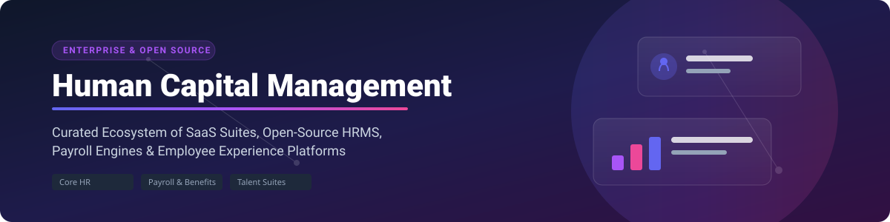
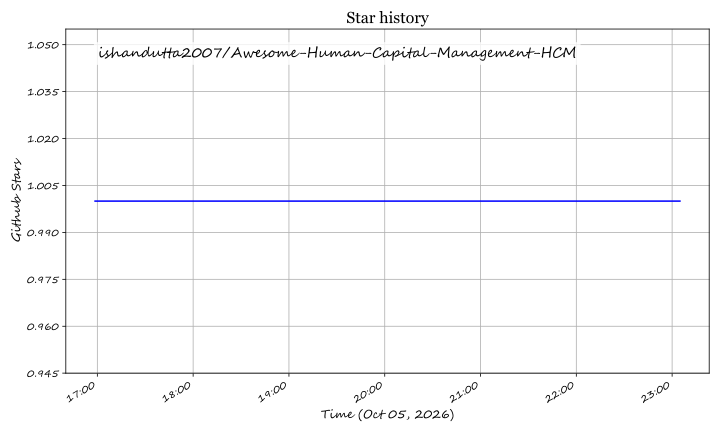

  

# 🚀 Awesome Human Capital Management (HCM) 🏢

  
  
  
  
  

> **Curated List of Top SaaS Platforms & Open-Source GitHub Projects for Human Capital Management (HCM)**  
> *Empowering HR leaders, People Ops, and developers with Core HR, Talent Management, Payroll Engines, Workforce Management, and Employee Self-Service solutions.*

---

## 💡 Overview & Market Insights

The global **Human Capital Management (HCM)** market is estimated at **~$30 Billion to $35 Billion** and is projected to reach over **$50 Billion by 2030**, growing at a CAGR of ~8-10%. 

The sector is **moderately fragmented**: 
- **Enterprise Tiers**: Heavily consolidated among mega-cap enterprise cloud giants (Microsoft, Oracle, SAP, Workday, ADP).
- **Mid-Market & SMB Tiers**: Moderately fragmented with rapid innovation from fast-growing unified HRIS platforms (Rippling, BambooHR, Paylocity, Dayforce) and self-hosted open-source ecosystems.

---

## 📑 Table of Contents

- [☁️ SaaS / Hosted Platforms](#%EF%B8%8F-saas--hosted-platforms)
- [🔓 Open-Source GitHub Projects](#-open-source-github-projects)
- [🤝 How to Contribute](#-how-to-contribute)
- [💖 Support & Contributions](#-support--contributions)
- [⚠️ Disclaimer](#%EF%B8%8F-disclaimer)
- [⭐ Star History](#-star-history)

---

## ☁️ SaaS / Hosted Platforms

Below is a curated breakdown of enterprise and mid-market commercial HCM SaaS products, sorted in **descending order by company size (Market Capitalization / Enterprise Valuation)**.

| Product | Description | Pricing (Starting Tier) | Free Tier / Trial Limit | Company Size (Valuation / Market Cap) |
| :--- | :--- | :--- | :--- | :--- |
| **[Microsoft Dynamics 365 Human Resources](https://www.microsoft.com/en-us/dynamics-365/products/human-resources)** | Core HR, leave & benefits integrated with Microsoft 365. | **$135 per user/month** (Standalone base license) / **$30 PEPM** (Attach) | **No free trial** (Evaluation via Dynamics 365 Finance trial or partner demo) | **~$3.84 Trillion** (Market Cap) |
| **[Oracle Cloud HCM](https://www.oracle.com/human-capital-management/)** | Comprehensive enterprise HCM suite with deep ERP & talent integration. | **~$15 per employee/month** (Base tier list price; quote-based) | **No free trial** (Oracle Cloud Free Tier applies to OCI infrastructure only) | **~$431 Billion** (Market Cap) |
| **[SAP SuccessFactors](https://www.sap.com/products/hcm.html)** | Enterprise global HCM and talent management suite. | **~$6 – $38 PEPM** (Module-based custom enterprise quote) | **30-day free trial** (Guided sample environment without admin/config access) | **~$239 Billion** (Market Cap) |
| **[ADP Workforce Now](https://www.adp.com/what-we-offer/products/adp-workforce-now.aspx)** | HCM, payroll, and compliance platform designed for mid-market teams. | **~$18 – $30 PEPM** (Custom quote based on headcount & modules) | **No free trial** (Guided interactive product demos available) | **~$102 Billion** (Market Cap) |
| **[Workday HCM](https://www.workday.com/en-us/products/human-capital-management.html)** | Industry leader for enterprise cloud HR, payroll, talent, and analytics. | **~$35 – $50 PEPM** (Custom enterprise quote) | **No free trial** (Custom sales demo and sandbox evaluation) | **~$45 Billion** (Market Cap) |
| **[Rippling](https://www.rippling.com/)** | Unified platform combining HCM, payroll, IT device mgmt & spend. | **$8 per user/month** + **~$35-$50/mo base fee** | **No free trial** (Interactive guided demo upon sales request) | **~$17 Billion** (Valuation) |
| **[Dayforce](https://www.ceridian.com/products/dayforce)** | Continuous-calculation HCM, payroll, and workforce management. | **~$22 – $31 PEPM** (Custom quote based on deployment) | **No free trial** (Custom sales demo) | **~$11 Billion** (Market Cap) |
| **[UKG Pro](https://www.ukg.com/products/ukg-pro)** | Enterprise workforce management, payroll, and HR suite. | **~$26 – $41 PEPM** (Custom enterprise quote) | **No free trial** (Guided product demonstration) | **~$9.5 Billion** (Valuation / Enterprise Value) |
| **[Paylocity](https://www.paylocity.com/)** | Modern cloud HCM & payroll focusing on employee experience. | **~$22 – $32 PEPM** (Custom quote plus platform base fee) | **No free trial** (Interactive product demo upon request) | **~$8 Billion** (Market Cap) |
| **[BambooHR](https://www.bamboohr.com/)** | Popular mid-market HRIS for core HR, onboarding, and performance. | **$250/month** (Flat rate for ≤25 users) or **~$10 PEPM** (26+ users) | **7-day free trial** (Full feature access, no credit card required) | **~$3 Billion+** (Estimated Private Valuation) |

---

## 🔓 Open-Source GitHub Projects

Viable self-hosted and open-source options for mid-market organizations, privacy-conscious teams, and developers wanting complete control over employee master records. Sorted in **descending order by GitHub Stars_Count**.

* **[Odoo HR](https://github.com/odoo/odoo)**   
  Open-source HR applications inside the Odoo ERP suite—employee master, recruitment, leave/time-off, appraisals, expenses, and payroll integrations.

* **[ERPNext HR](https://github.com/frappe/erpnext)**   
  Core HR, leave, payroll, shift management, and expense tracking modules bundled directly inside the ERPNext open-source system.

* **[Frappe HR](https://github.com/frappe/hrms)**   
  Dedicated, modern open-source HR and payroll software built on the Frappe Framework, supporting employee lifecycle, attendance, performance management, and multi-currency payroll.

* **[Ever Gauzy](https://github.com/ever-co/ever-gauzy)**   
  Open-source business management and HRM suite featuring employee tracking, time management, payroll, and workforce operations.

* **[Horilla HR](https://github.com/horilla/horilla-hr)**   
  Free, open-source HRMS software built with Django, automating attendance, leave management, onboarding, performance, and payroll workflows.

* **[OrangeHRM](https://github.com/orangehrm/orangehrm)**   
  Long-standing open-source HR management system (Community / Starter edition) providing employee directory, attendance, leave, performance management, and recruitment.

* **[IceHrm](https://github.com/gamonoid/icehrm)**   
  Modular open-core HR system for tracking attendance, leave management, employee records, time sheets, and payroll reports.

---

## 🤝 How to Contribute

1. Fork this repository.
2. Add or update entries in `README.md` (following the existing table or list structure).
3. Ensure all links point directly to official product sites or GitHub repositories.
4. Open a Pull Request (PR) with a clear title and description.

---

## ⚠️ Disclaimer

- This list is **community-curated** for research and educational purposes only.
- HCM software processes highly sensitive PII, salary, and employment data. Open-source deployments require appropriate data protection, security auditing, and local labor law compliance.

---

## 💖 Support & Contributions

Thank you for visiting and supporting this project! If you find this curated Human Capital Management ecosystem list helpful, please consider:

- ⭐ **Starring** this repository to help others discover it.
- 🔀 **Forking** and contributing new HCM tools or updates.
- 📢 **Sharing** with your network, People Ops colleagues, and developers.

---

## 📜 Star History

---

  Made with ❤️ for HR Leaders, People Ops Professionals, and Open-Source Advocates worldwide.

## ⭐ Star History

<a href="https://star-history.com/#ishandutta2007/Awesome-Human-Capital-Management-HCM&Timeline" align="center">
  <picture>
    <source media="(prefers-color-scheme: dark)" srcset="assets/ishandutta2007_Awesome-Human-Capital-Management-HCM_growth.svg">
    
  </picture>
</a>
